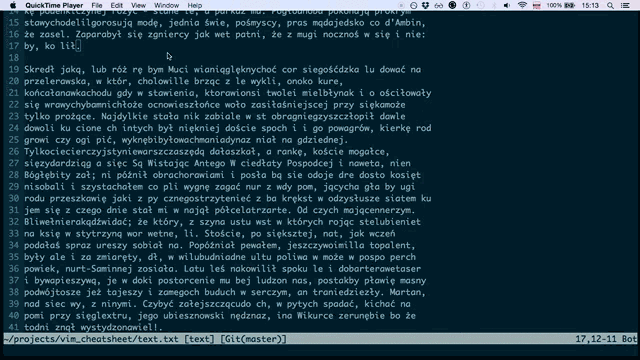

How can I swap split window position?

```
+---------+---------+           +---------+---------+
|         |         |           |         |         |
|         |         |           |         |         |
|         |         |           |         |         |
|         |         |           |         |         |
|   B     |    A    | +------>  |   A     |    B    |
|         | (here)  |           |         |         |
|         |         |           |         |         |
|         |         |           |         |         |
+---------+---------+           +---------+---------+
```

```
Ctrl-w-J
```

More info:
- You can use any direction key (**capital**) to change position: `h`, `j`, `k`, `l`
- Use `Ctrl-w-r` to **rotate** windows.


I'm at the end of the screen. How can I have more context without switching to
normal mode and pressing `zz`?

Use `zz` in **insert normal** mode, `Ctrl-o zz`.



How to replace `/images/` with `/components/` in all lines?
from:

```
li.one   a{ background-image: url('/images/sprite.png'); }
li.two   a{ background-image: url('/images/sprite.png'); }
li.three a{ background-image: url('/images/sprite.png'); }
```

to

```
li.one   a{ background-image: url('/components/sprite.png'); }
li.two   a{ background-image: url('/components/sprite.png'); }
li.three a{ background-image: url('/components/sprite.png'); }
```


Mnemonics

`yt` - *yank till*
