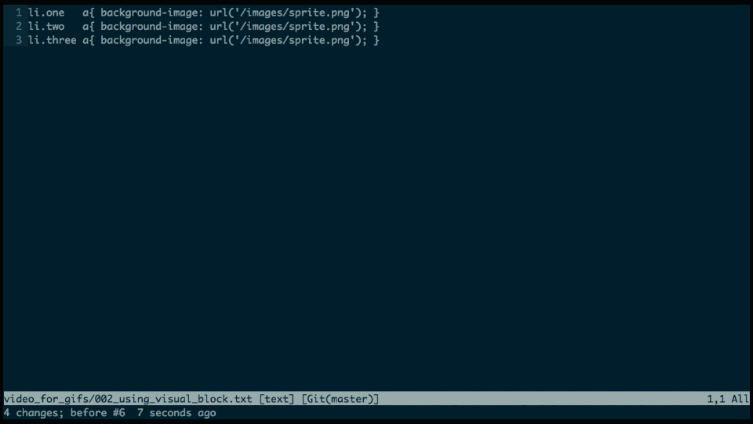

How can I swap split window position?

```
+---------+---------+           +---------+---------+
|         |         |           |         |         |
|         |         |           |         |         |
|         |         |           |         |         |
|         |         |           |         |         |
|   B     |    A    | +------>  |   A     |    B    |
|         | (here)  |           |         |         |
|         |         |           |         |         |
|         |         |           |         |         |
+---------+---------+           +---------+---------+
```

```
Ctrl-w-J
```

More info:
- You can use any direction key (**capital**) to change position: `h`, `j`, `k`, `l`
- Use `Ctrl-w-r` to **rotate** windows.


I'm at the end of the screen. How can I have more context without switching to
normal mode and pressing `zz`?

Use `zz` in **insert normal** mode, `Ctrl-o zz`.


How to replace `/images/` with `/components/` in all lines?
from:

```
li.one   a{ background-image: url('/images/sprite.png'); }
li.two   a{ background-image: url('/images/sprite.png'); }
li.three a{ background-image: url('/images/sprite.png'); }
```

to

```
li.one   a{ background-image: url('/components/sprite.png'); }
li.two   a{ background-image: url('/components/sprite.png'); }
li.three a{ background-image: url('/components/sprite.png'); }
```




Mnemonics

`yt` - *yank till*


I'm refactoring `deadline_at` method and as a part of it I'm also changing its name to
`due_date`. I'd like to change the name in all occurrences.

First find all occurrences:

```
Ag! `due_date`
```

`!` doesn't stop at first found result. Now you can replace `deadline_at` with
`due_date` in all open buffers:

```
:bufdo %s/deadline_at/due_date/gce
```

How to paste below current line?

```
:put a
```

Note: `"ap` would paste after the cursor position on the current line


How to format text with par (http://vimcasts.org/episodes/formatting-text-with-par/)

```
gq
```

How to toggle between the current and the last buffer in normal mode?

```
Ctrl-^
```

How to do project-wide search and replace with `Ag`?

```
:Ag contact_id app/front-end
:Qargs | argdo %s/contact_id/kontakt_ajdi/gc | update
```
more info:

- [`vim-qargs` plugin by **Drew Neil**](https://github.com/nelstrom/vim-qargs)
- [Project-wide search-and-replace in Vim with :Qdo](http://thepugautomatic.com/2012/07/project-wide-search-and-replace-in-vim-with-qdo/)
- [command
  source](http://stackoverflow.com/questions/5686206/search-replace-using-quickfix-list-in-vim/5686810#5686810)
